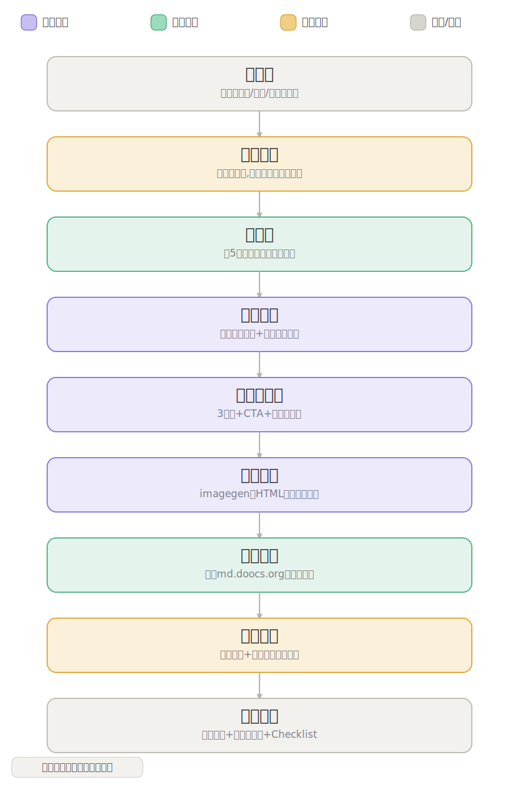

# wechat-article-writer

> 公众号文章全流程写作 Skill —— 从选题到发布就绪，一站式完成。

## 🗺️ 一图看懂流程



> 🟪 新写代码 · 🟩 复用现成 · 🟧 省钱闸门 · ⬜ 输入/输出

---

## 功能概览

| 步骤 | 内容 |
|------|------|
| STEP 1 | 确认写文参数（主题/风格/骨架/Thesis/字数） |
| STEP 2 | 匹配最合适的内容骨架 |
| STEP 3 | 全网 100+ 信源采集 + 按骨架写正文 |
| STEP 4 | 输出配套内容包（3标题 + CTA + 朋友圈文案） |
| STEP 5 | 自动注入 md.doocs.org 完成排版交付 |
| STEP 6 | 输出发布前 Checklist |

## 写作引擎

写作模块默认使用通用骨架，支持一键切换：

```
# 切换为晚点LatePost深度报道风格
→ 自动调用 latepost-writer Skill
```

## 支持的内容骨架

- 🏢 战略拆解型 — 公司发展路径与战略决策
- 👤 人物特写型 — 创始人/高管深度人物稿
- 📊 行业变局型 — 赛道趋势与市场格局分析
- 📱 产品逻辑型 — 产品设计与演化拆解
- 💰 创投生态型 — 融资事件与投资逻辑解读

## 默认排版风格

内置「第101个机器人」公众号排版规范：
- 橙色数字序号小标题（`01 标题`）
- 简约白底，大量留白
- 加粗强调关键句
- `-end-` 结尾标识

## 触发词

```
写公众号 / 帮我写推文 / 公众号文章 / wechat article
```

## 相关 Skill

- [latepost-writer](../latepost-writer/) — 晚点LatePost风格深度商业报道写作

---

*第101个机器人 × latepost-writer × wechat-article-writer*
